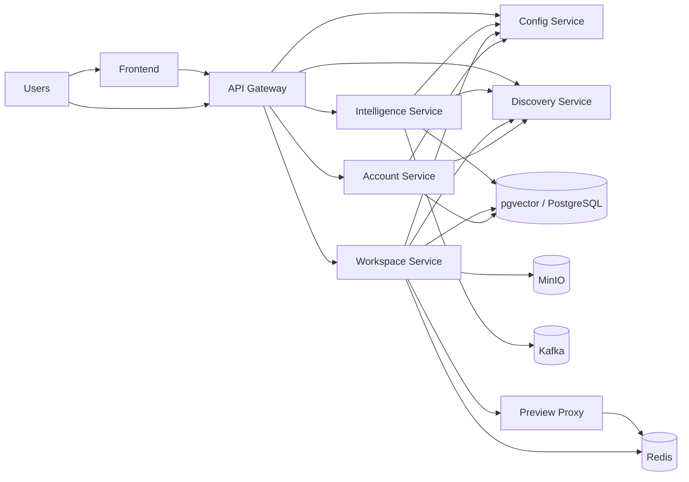

# Distributed WebGenAI

Distributed WebGenAI is a Spring Boot microservices platform for building and running AI-assisted workspace experiences. It combines authentication, project/workspace management, AI chat and generation, centralized configuration, service discovery, and Kubernetes-based preview deployment support.

## What is in this repository

This repository is organized as a set of standalone Maven projects rather than a single parent build. Each service has its own `pom.xml`, Maven wrapper, source tree, and test tree.

```text
Distributed-WebGenAI/
  account-service/
  api_gateway/
  common-lib/
  config_service/
  discovery_service/
  intelligent_service/
  workspace_service/
  k8s/
```

## System Overview



## Services

| Service | Location | Responsibility | Port |
| --- | --- | --- | --- |
| Discovery Service | `discovery_service/` | Eureka service registry for Spring services | `8761` |
| Config Service | `config_service/` | Centralized Spring Cloud Config server | `8888` |
| API Gateway | `api_gateway/` | Edge routing, gateway filtering, JWT-based gateway security | `8080` in container, exposed on `80` in Kubernetes |
| Account Service | `account-service/` | Authentication, user accounts, subscriptions, billing, Stripe integration | `9050` in container, exposed on `80` in Kubernetes |
| Workspace Service | `workspace_service/` | Projects, files, members, deployment workflow, preview orchestration | `9020` in container, exposed on `80` in Kubernetes |
| Intelligence Service | `intelligent_service/` | AI chat, generation, usage tracking, and workspace/account integrations | `9030` in container, exposed on `80` in Kubernetes |
| Common Lib | `common-lib/` | Shared DTOs, security helpers, events, enums, and error types | Library only |
| Frontend | `k8s/services/frontend.yaml` | Static web UI served through Kubernetes ingress | `80` |
| Preview Proxy | `k8s/proxy/` | Wildcard proxy that routes preview subdomains to running preview environments | `80` |

## Service Notes

### Discovery Service

The discovery service is a Spring Cloud Eureka server. It does not register itself and is meant to support service discovery for the other Spring Boot services.

### Config Service

The config service is the shared configuration source for the platform. Other services import configuration from `CONFIG_SERVER_URL`, which points to the config server in Kubernetes.

### API Gateway

The gateway is the external entry point for backend traffic. It uses Spring Cloud Gateway, JWT handling, and shared security utilities from `common-lib`.

### Account Service

The account service manages users, authentication, plans, subscriptions, and billing. It integrates with Stripe and PostgreSQL.

### Workspace Service

The workspace service manages projects, files, members, file storage, deployment metadata, and preview-related functionality. It uses PostgreSQL, Redis, MinIO, and Kubernetes-facing integration points.

### Intelligence Service

The intelligence service provides AI features such as chat and code generation, and it tracks usage and message/session data. It also integrates with other services through Feign clients and shared security components.

### Common Lib

The shared library contains reusable authentication, security, event, DTO, enum, and error-handling code used by the main services.

### Frontend

The frontend is deployed as a separate static web application and served from the main domain through Kubernetes ingress.

### Preview Proxy

The preview proxy is a small Node.js service that looks up preview routing targets in Redis and forwards HTTP/WebSocket traffic to the correct preview environment. It is used for wildcard preview subdomains.

## Kubernetes and Runtime Infrastructure

The `k8s/` folder contains the deployment and infrastructure definitions used by the platform:

- `k8s/infra/` contains namespaces, shared config, and ingress rules.
- `k8s/services/` contains the core microservice deployments and services.
- `k8s/stateful/` contains the backing stateful dependencies.
- `k8s/proxy/` contains the preview proxy implementation.

### Ingress routes

- `sagardevlab.in` and `www.sagardevlab.in` route to the frontend.
- `api.sagardevlab.in` routes to the API gateway.
- `*.previews.sagardevlab.in` routes to the preview proxy.

### Stateful dependencies

| Dependency | Purpose | Port |
| --- | --- | --- |
| PostgreSQL with pgvector | Persistence for account, workspace, and intelligence data | `5432` |
| Redis | Preview routing and fast key/value state | `6379` |
| MinIO | Object storage for workspace assets and generated files | `9000`, `9001` |
| Kafka | Event streaming / saga-style service communication | `9092`, `29093` |

## Shared Runtime Dependencies

Most Spring services use the same Kubernetes-backed runtime patterns:

- `SPRING_PROFILES_ACTIVE=k8s`
- `CONFIG_SERVER_URL=http://config-service.webgenai-core.svc.cluster.local:8888`
- `SPRING_CLOUD_CONFIG_FAIL_FAST=false`
- `SPRING_CLOUD_CONFIG_RETRY_MAX_ATTEMPTS=10`
- `SPRING_CLOUD_CONFIG_RETRY_INITIAL_INTERVAL=3000`

Secrets and environment variables are injected through Kubernetes secrets and config maps, including:

- `JWT_SECRET`
- `DB_PASSWORD`
- `POSTGRES_PASSWORD`
- `STRIPE_API_KEY`
- `STRIPE_WEBHOOK_SECRET`
- `AI_API_KEY`
- `MINIO_ROOT_USER`
- `MINIO_ROOT_PASSWORD`
- `GIT_USERNAME`
- `GIT_PASSWORD`

## Local Build

Each Spring Boot module can be built independently with its own Maven wrapper.

```bash
cd account-service
./mvnw clean test

cd ../api_gateway
./mvnw clean test

cd ../config_service
./mvnw clean test

cd ../discovery_service
./mvnw clean test

cd ../intelligent_service
./mvnw clean test

cd ../workspace_service
./mvnw clean test
```

On Windows PowerShell, use `mvnw.cmd` instead of `./mvnw`.

The preview proxy is a Node.js service:

```bash
cd k8s/proxy
npm install
npm start
```

## Suggested Start Order

If you are running the platform outside Kubernetes, start the services in this order:

1. PostgreSQL / pgvector, Redis, MinIO, and Kafka.
2. Config Service.
3. Discovery Service.
4. Account Service, Workspace Service, and Intelligence Service.
5. API Gateway.
6. Frontend and the preview proxy, if you are testing the full web experience.

## Repository Purpose

This codebase is intended to support a distributed GenAI product with:

- user authentication and billing
- project and workspace management
- AI-assisted generation and chat
- preview environments for generated applications
- Kubernetes deployment for core services and shared state

## Notes

- There is no single root Maven parent in this repository; the services are intentionally independent.
- The exact service implementation details live in each module under `src/main/java` and are exposed through Spring Boot application classes and Kubernetes manifests.
- For production deployment, the `k8s/` manifests are the best reference for ports, environment variables, and inter-service dependencies.