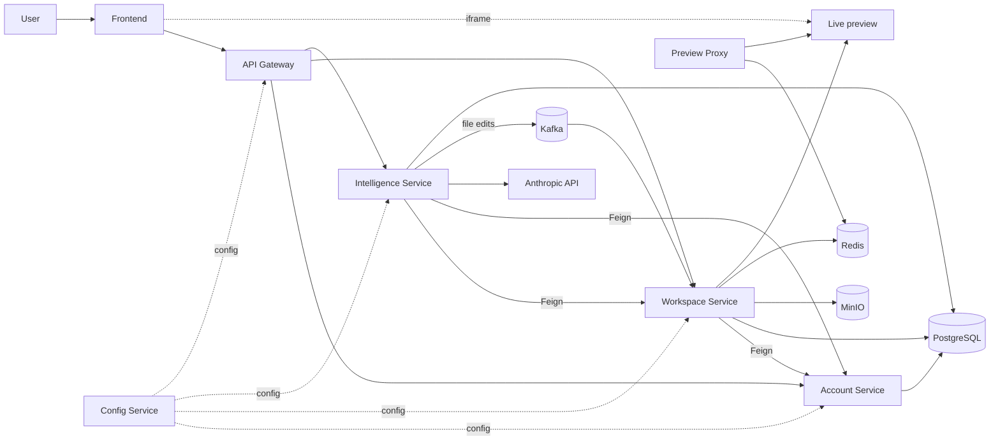

# Distributed WebGenAI

Distributed WebGenAI is an AI web-app builder built as Spring Boot microservices. You describe an app in plain words, Claude writes the React code, and the running app appears in a live preview next to the chat. Every follow-up prompt edits the same app and the preview hot-reloads.

The platform covers accounts and plans, projects and their files, AI generation with streaming output, per-project live previews, centralized configuration, and Kubernetes deployment.

## What is in this repository

The repository is a set of standalone Maven projects rather than a single parent build. Each service has its own `pom.xml`, Maven wrapper, source tree and tests.

```text
Distributed-WebGenAI/
  account-service/     users, login, plans, Stripe billing
  api_gateway/         single entry point, JWT check, routing
  common-lib/          shared DTOs, security, events, errors
  config_service/      Spring Cloud Config server + bundled config-repo
  discovery_service/   Eureka registry (optional)
  intelligent_service/ AI generation (Claude), chat history, token usage
  workspace_service/   projects, files, members, live previews
  frontend/            React UI: chat, live preview, code view
  k8s/                 Kubernetes manifests + preview proxy
  local/               helper files for running locally
  docker-compose.yml   Postgres, Redis, Kafka, MinIO for local development
```

## System overview


```mermaid
flowchart LR
  U[User] --> FE[Frontend]
  FE --> GW[API Gateway]
  FE -. iframe .-> PV[Live preview]

  GW --> ACC[Account Service]
  GW --> WS[Workspace Service]
  GW --> AI[Intelligence Service]

  AI -->|Feign| WS
  AI -->|Feign| ACC
  WS -->|Feign| ACC
  AI --> CLAUDE[Anthropic API]

  AI -- file edits --> KAFKA[(Kafka)]
  KAFKA --> WS

  ACC --> PG[(PostgreSQL)]
  WS --> PG
  AI --> PG
  WS --> MINIO[(MinIO)]
  WS --> REDIS[(Redis)]
  WS --> PV
  PXY[Preview Proxy] --> REDIS
  PXY --> PV

  CFG[Config Service] -. config .-> ACC & WS & AI & GW
```

## Services

| Service | Location | Responsibility | Port |
| --- | --- | --- | --- |
| Config Service | `config_service/` | Serves configuration to every service | `8888` |
| API Gateway | `api_gateway/` | Routing, JWT validation, CORS, blocks `/internal/**` | `8080` |
| Account Service | `account-service/` | Sign-up/login, plans (Free/Pro/Business), Stripe billing | `9050`, path `/account` |
| Workspace Service | `workspace_service/` | Projects, files (MinIO), members, starter template, live previews | `9020`, path `/workspace` |
| Intelligence Service | `intelligent_service/` | Claude code generation, chat history, daily token limits | `9030`, path `/intelligence` |
| Discovery Service | `discovery_service/` | Eureka registry (optional, not used by default) | `8761` |
| Common Lib | `common-lib/` | Shared DTOs, JWT utilities, Kafka events, enums, error handling | library |
| Frontend | `frontend/` | React UI: auth, projects, streaming chat, live preview, code view | `5173` in dev, `80` in the container |
| Preview Proxy | `k8s/proxy/` | Routes `project-<id>.previews.<domain>` to the right preview pod | `80` |

In Kubernetes every service is exposed on port `80` through its `Service`.

## Service notes

### Config Service

Other services import their configuration from `CONFIG_SERVER_URL` (default `http://localhost:8888`). The configuration lives in `config_service/src/main/resources/config-repo/` and is served with the `native` backend:

- `application.yaml` holds shared settings (JWT secret, Kafka serialization, service-to-service URLs).
- `<service>.yaml` holds per-service settings (port, context path, database, MinIO, AI model, gateway routes).
- `*-k8s.yaml` files override hostnames when a service runs with `SPRING_PROFILES_ACTIVE=k8s`.

To serve an external Git repository instead, start the config service with `CONFIG_BACKEND=git` plus `CONFIG_GIT_URI`, `GIT_USERNAME` and `GIT_PASSWORD`.

### API Gateway

The single entry point for browser traffic. It validates the JWT on every non-public route, routes `/account/**`, `/workspace/**` and `/intelligence/**` to the matching service, and returns `403` for any `/*/internal/**` path so service-to-service endpoints can't be reached from outside. Allowed browser origins are set with `CORS_ALLOWED_ORIGINS` (comma-separated).

### Account Service

Handles sign-up, login (JWT), plans, subscriptions and Stripe checkout/webhooks. On first start it seeds three plans (Free, Pro, Business). Users without a paid subscription are on the Free plan: 3 projects and 100,000 AI tokens per day.

### Workspace Service

Manages projects, members and files. File contents are stored in MinIO, metadata in Postgres. On every start it creates the MinIO buckets and uploads the starter template from `src/main/resources/starter-template/` (React 19, Vite 6, Tailwind 4, daisyUI 5, lucide-react, with a lockfile). Each new project is a copy of that template.

It also runs the live previews, in one of two modes (`app.preview.mode`):

| Mode | Used when | How it works |
| --- | --- | --- |
| `local` | default outside Kubernetes | Copies the project to `<tmp>/webgenai-previews/project-<id>` and runs the Vite dev server on port `5200 + id`. AI edits are written straight into that folder. |
| `k8s` | `SPRING_PROFILES_ACTIVE=k8s` | Claims an idle pod from `runner-pool`, syncs the files from MinIO with `mc mirror --watch`, and registers the route in Redis for the preview proxy. |

### Intelligence Service

Generates code with Claude through the Anthropic API (Spring AI). It gives the model the project's file tree and a `read_files` tool, streams the model's output to the browser, stores the conversation, and records token usage against the user's daily plan limit. Errors from the AI provider, such as an invalid key or rate limiting, are shown in the chat.

### Discovery Service

A Eureka server. It is optional: by default the services call each other through the URLs in the config repo (`ACCOUNT_SERVICE_URI`, `WORKSPACE_SERVICE_URI`, `INTELLIGENCE_SERVICE_URI`), and the Eureka client is disabled.

### Frontend

A React + Vite app. It streams the AI's output over server-sent events, shows file reads and edits as they happen, and renders the generated app in an iframe. Set `VITE_API_URL` to the gateway URL (default `http://localhost:8080`). For Kubernetes it is built into an nginx image (`frontend/Dockerfile`).

### Preview Proxy

A small Node.js service that looks up `route:<hostname>` in Redis and forwards HTTP and WebSocket traffic (including Vite hot reload) to the matching preview pod.

## How a generation works

1. The user sends a prompt from the chat panel. The frontend calls `POST /intelligence/chat/stream`.
2. The intelligence service checks the user's daily token limit, adds the project's file tree to the prompt, and lets Claude call `read_files`. Claude's answer streams back as `<message>`, `<tool>` and `<file path="...">` tags.
3. When the stream completes, the answer is parsed into chat events and saved. Each `<file>` is published to Kafka (`file-storage-request-event`).
4. The workspace service writes the file to MinIO, records it in Postgres, and replies on `file-store-responses`. The chat event is marked `CONFIRMED`.
5. The running preview picks up the change and Vite hot-reloads it in the iframe.

## Configuration

| Variable | Used by | Default | Purpose |
| --- | --- | --- | --- |
| `JWT_SECRET` | all services | none (required) | Signs and validates login tokens. At least 32 characters; every service refuses to start without it. |
| `ANTHROPIC_API_KEY` | intelligence | none (required) | Anthropic API key |
| `ANTHROPIC_MODEL` | intelligence | `claude-opus-5` | Claude model used for code generation |
| `AI_PROVIDER` | intelligence | `anthropic` | Set to `openai` to use an OpenAI-compatible API instead (`AI_API_KEY`, `AI_BASE_URL`, `AI_MODEL`) |
| `STRIPE_API_KEY`, `STRIPE_WEBHOOK_SECRET` | account | placeholders | Only needed for paid-plan checkout |
| `FRONTEND_URL` | account | `http://localhost:5173` | Stripe checkout return URL |
| `CORS_ALLOWED_ORIGINS` | gateway | localhost + sagardevlab.in | Browser origins allowed to call the API |
| `DB_PASSWORD`, `MINIO_ROOT_USER`, `MINIO_ROOT_PASSWORD` | account, workspace, intelligence | match `docker-compose.yml` | Database and object-storage credentials |
| `PREVIEW_MODE` | workspace | `local` | `local` or `k8s` preview runner |

## Run locally

Prerequisites: JDK 21, Maven, Node 20+, Docker.

**1. Start the backing services** (Postgres on host port `5433`, Redis `6379`, Kafka `9092`, MinIO `9000`/`9001`):

```bash
docker compose up -d
```

**2. Install the shared library** (every service depends on it):

```bash
cd common-lib && mvn install -DskipTests
```

**3. Set the required secrets.** Every service must use the same `JWT_SECRET`:

```powershell
# Windows: open new terminals afterwards
setx JWT_SECRET "<a random string of 32+ characters>"
setx ANTHROPIC_API_KEY "sk-ant-..."
```
```bash
# macOS / Linux
export JWT_SECRET="$(openssl rand -base64 48)"
export ANTHROPIC_API_KEY="sk-ant-..."
```

**4. Start the Spring services**, each in its own terminal, config service first:

```bash
cd config_service      && mvn spring-boot:run   # :8888
cd account-service     && mvn spring-boot:run   # :9050  /account
cd workspace_service   && mvn spring-boot:run   # :9020  /workspace
cd intelligent_service && mvn spring-boot:run   # :9030  /intelligence
cd api_gateway         && mvn spring-boot:run   # :8080
```

**5. Start the frontend:**

```bash
cd frontend && npm install && npm run dev   # http://localhost:5173
```

Sign up, create a project and describe the app you want. The first preview of a project takes about a minute while `npm install` runs; each project's `dev.log` is in `<tmp>/webgenai-previews/project-<id>`.

To stop the backing services, run `docker compose stop` (data is kept) or `docker compose down -v` (data is deleted).

## Tests

```bash
cd <service> && mvn verify
```

Tests run without the stack: unit tests for JWT signing and validation (`common-lib`, `api_gateway`) and for parsing the AI's output (`intelligent_service`), plus standalone context tests for the config and discovery services. Install `common-lib` first.

## Kubernetes

The `k8s/` folder holds the deployment:

- `k8s/infra/` - namespaces, shared config map, ingress, network policies, preview runner pool
- `k8s/stateful/` - PostgreSQL (pgvector), Redis, Kafka, MinIO
- `k8s/services/` - the Spring services and the frontend
- `k8s/proxy/` - the preview proxy (source, Dockerfile and deployment)

Ingress routes:

- `sagardevlab.in` and `www.sagardevlab.in` → frontend
- `api.sagardevlab.in` → API gateway
- `*.previews.sagardevlab.in` → preview proxy

**Build the images.** Each Spring service's `Dockerfile` is built from the repository root:

```bash
docker build -f account-service/Dockerfile      -t sagar/webgenai-account-service .
docker build -f workspace_service/Dockerfile    -t sagar/webgenai-workspace-service .
docker build -f intelligent_service/Dockerfile  -t sagar/webgenai-intelligence-service .
docker build -f api_gateway/Dockerfile          -t sagar/webgenai-api-gateway .
docker build -f config_service/Dockerfile       -t sagar/webgenai-config-service .
docker build -f frontend/Dockerfile --build-arg VITE_API_URL=https://api.sagardevlab.in -t sagar/webgenai-frontend frontend
docker build -t sagar/webgenai-me-proxy k8s/proxy
```

**Create the secrets.** Copy `k8s/.env.example` to `k8s/.env` (git-ignored), fill in real values, and create the `app-secrets` secret in both namespaces as shown at the top of that file.

**Apply the manifests** in this order: `infra/namespaces.yaml` → `stateful/` → `services/` → `proxy/` → the rest of `infra/`. With `SPRING_PROFILES_ACTIVE=k8s` the services use the in-cluster hostnames from the `*-k8s.yaml` config files, and the workspace service uses the runner-pool preview mode.

## Known limitations

- Stripe billing needs real keys and price IDs. The seeded Pro and Business plans use placeholder price IDs; update the `plan` table once you have real ones.
- A generation is saved only when the stream completes. If the browser disconnects mid-generation, that turn is lost.
- `/account/auth/me` is not implemented yet. The frontend keeps the user from the login response.
- Local previews are not stopped automatically. They end when the workspace service stops.
